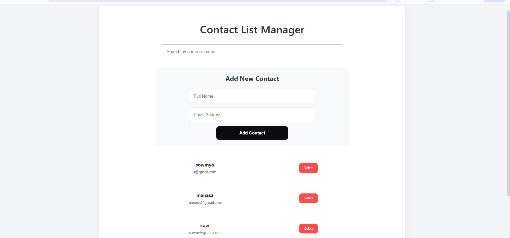
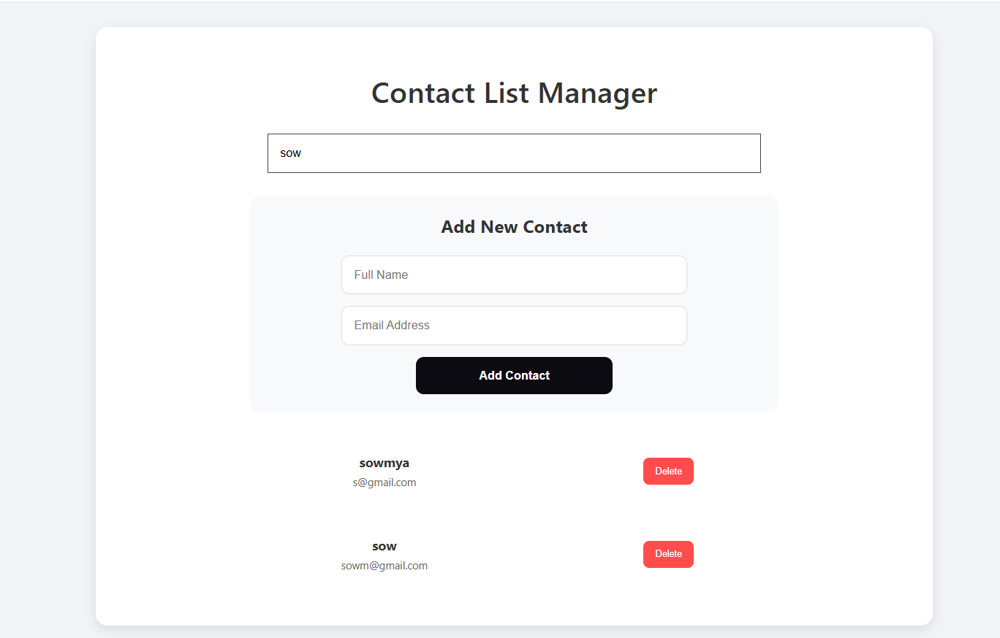

#  Contact Manager App

A simple full-stack contact management application built with **React** and **Node.js**, allowing users to add, search, and delete contacts.

---

## 🛠 Tech Stack

- **Frontend**: React
- **Backend**: Node.js 
- **Database**: LowDB 

---

##  Features

- Add new contacts (Name & Email)
- Search contacts by name or email
- Delete contacts with confirmation
- Responsive and clean UI

---

##  Getting Started

Clone the repository and install dependencies:

```bash
git clone https://github.com/SowmyaKoneti/contact-manager.git
cd contact-manager

# Install backend dependencies
cd backend
npm install
npm install lowdb

# Install frontend dependencies
cd ../frontend
npm install
```

### Run the app

```bash
# Start backend (in one terminal)
cd backend
npm run dev

# Start frontend (in another terminal)
cd frontend
npm run dev
```

Visit the app in your browser:  
 [http://localhost:5173](http://localhost:5173)

---

##  Solution Explanation & Trade-offs

This Contact Manager app uses `fetch()` on the frontend to communicate with a Node.js backend. The backend stores contact data in a local JSON file using **LowDB**.

The UI is split into reusable components like:

- `ContactList`
- `AddContactForm`

### ⚖️ Trade-offs and Decisions

1.  Used `lowdb` for quick setup.
2.  Focused on core functionality over complex styling to keep the UI simple and understandable.
3.  Skipped test cases due to time limits.
5. Handled many edge cases in UI and deletion flows.
---


## UI Screenshot



